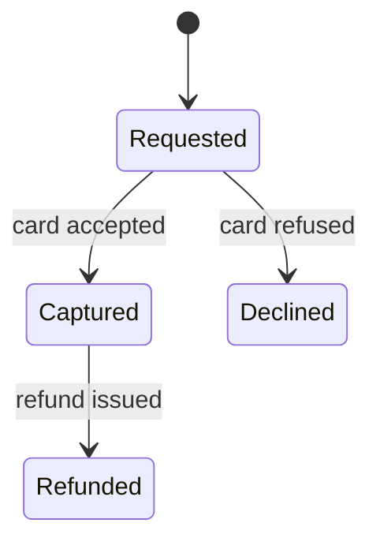

## Overview

Charges customers and handles refunds.

```mermaid
stateDiagram-v2
  [*] --> Requested
  Requested --> Captured: card accepted
  Requested --> Declined: card refused
  Captured --> Refunded: refund issued
```

## Architecture

<Neighborhood />

## Messages

<MessageList />
